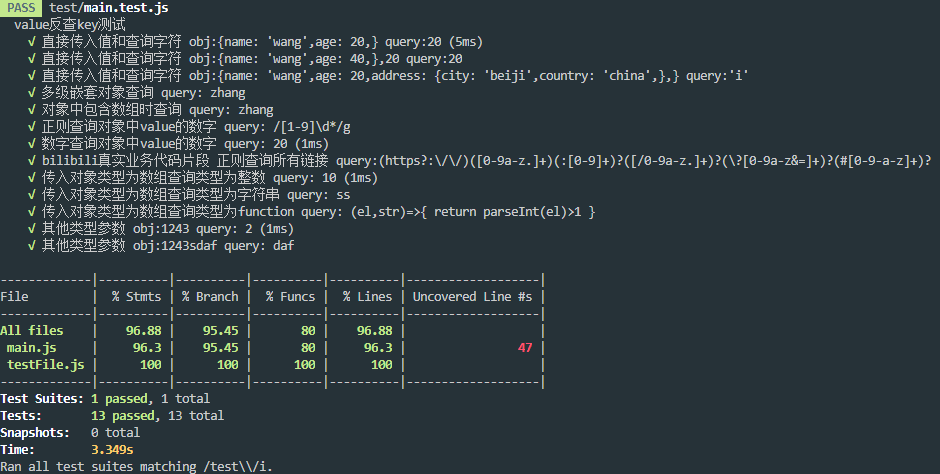

# npm Jest环境示例

> JEST是一个优雅的JavaScript测试框架，侧重于简单性。他可以在`babe`,`Typescript`,`Node`,`React`,`Angular`,`Vue`甚至更多项目中使用

## 安装
配置过程

### 安装Jest 
`npm install jest --save-dev`
### 使用方法
 
先在您的项目目录下的`/src`路径中创建需要测试的模块 `add.js`内容为

```js
module.exports = add = (a,b)=>a+b;
```

创建脚本测试目录 `test` 脚本文件命名为 <模块名>.test.js 
```js
// 示例test脚本文件内容
const add = require('../src/add')

describe("加法函数测试",()=>{
    test("1+1等于2",()=>{
        expect(add(1,1)).toBe(2)
    })
})
```
在 `package.json`中配置如下测试命令
```json
"scripts": {
    "test-jest": "jest test-jest/"
}
```
运行`npm run test-jest`即可看到获得测试结果

## 覆盖统计
jest内置覆盖统计,为了更方便的进行相关配置,我们需要先在项目目录下`同package.json`创建一个配置文件`jest.config.js`
```js
// 示例jest配置文件内容
module.exports = {
    // 开启覆盖统计功能
    collectCoverage: true,
    // 将要覆盖的文件
    collectCoverageFrom: ["src/*.js"],
    // 输出覆盖统计结果的目录
    coverageDirectory: "test/coverage/",
    // 测试脚本路径
    testMatch: ["**/test/*.test.js"]
};
```
然后将`package.json`中的命名修改一下`"test-jest": "jest"`再次运行即可获得统计结果

参考代码在src下

# 运行jest测试

`git clone https://github.com/moshuying/nodeEnv/tree/master/jest`

`npm install --registry https://registry.npm.taobao.org && npm run test`

jest运行结果

